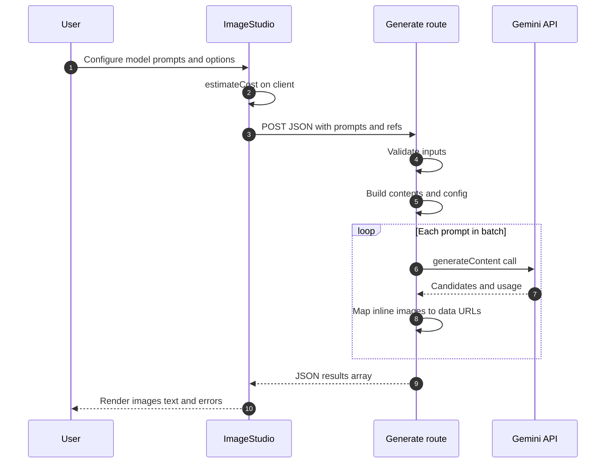

# Gemini Image Studio

A full-height **Next.js** web app for generating images with Google’s **Gemini API** (`@google/genai`). It wraps `generateContent` for image-capable models, exposes model-specific options (aspect ratio, resolution, grounding, thinking), and shows **approximate cost estimates in CAD** before you run a job.

---

## Features

| Area                 | Details                                                                                                                                                                                                 |
| -------------------- | ------------------------------------------------------------------------------------------------------------------------------------------------------------------------------------------------------- |
| **Models**           | Gemini 2.5 Flash Image, Gemini 3 Pro Image (preview), Gemini 3.1 Flash Image (preview). Labels and `apiId` values live in `lib/models.ts`.                                                              |
| **Prompts**          | Single prompt or **batch mode** (one `POST /api/generate` call per non-empty prompt box).                                                                                                               |
| **Reference images** | Browser uploads via **presigned S3 PUT**, then **public HTTPS URLs** as `fileData.fileUri` so Gemini fetches the image ([external URL input](https://ai.google.dev/gemini-api/docs/file-input-methods)). Model caps enforced (e.g. 3 for 2.5 Flash, 14 for Gemini 3.x). With references, response modalities include **TEXT + IMAGE**. **Drag and drop** works anywhere on the app surface (ChatGPT-style overlay). |
| **Output**           | Aspect ratio per official tables (default **9:16** when the model supports it). Output size **512 / 1K / 2K / 4K** where supported (512 only on 3.1 Flash). Single-prompt runs show a **loading** state in the output panel, same as batch. |
| **Grounding**        | **Google Search** off, web-only, or web + image search (image search on **Gemini 3.1 Flash** only).                                                                                                       |
| **Advanced**         | Thinking level, optional thought parts, person-generation policy, temperature, seed—when the model supports them.                                                                                       |
| **Cost**             | Client-side estimate from `lib/cost-estimate.ts`, shown as **CAD** via `USD_TO_CAD_APPROX`. Not a bill; Google prices in USD.                                                                             |
| **Auth**             | **NextAuth** with Google. Only emails listed in **`ALLOWED_USER_EMAILS`** can sign in or call generation / S3 routes.                                                                                    |
| **UI**               | **≥1280px (`xl`)**: wide layout with scrollable inputs and output column. **&lt;1280px**: stacked layout with a fixed bottom bar for **Generate**. Theme toggle, user menu, estimated cost popover, optional **Save to Google Drive** on generated images (Drive scope on sign-in). |

---

## Tech stack

- **Framework**: [Next.js 15](https://nextjs.org/) (App Router), React 19
- **SDK**: [`@google/genai`](https://www.npmjs.com/package/@google/genai) — `GoogleGenAI`, `generateContent`, `ThinkingLevel`, `imageConfig`, optional Google Search tools
- **Auth**: [NextAuth.js v5](https://authjs.dev/) (Google provider)
- **Storage**: [AWS SDK for JavaScript v3](https://docs.aws.amazon.com/sdk-for-javascript/v3/developer-guide/) — S3 presigned uploads for reference images
- **Styling**: [Tailwind CSS v4](https://tailwindcss.com/) (`@import "tailwindcss"` in `app/globals.css`)
- **Fonts**: [Geist](https://vercel.com/font) via `next/font/google` in `app/layout.tsx`
- **Language**: TypeScript

---

## Project structure

```text
app/
  layout.tsx                 # Root layout, theme, Geist fonts
  page.tsx                   # Renders ImageStudio
  globals.css                # Tailwind v4, theme tokens, interactive cursor base styles
  providers.tsx              # Session + theme providers
  api/
    generate/route.ts        # POST: Gemini generateContent (auth + allow list)
    s3/presign-reference/route.ts   # POST: presigned PUT URLs + public object URLs
    auth/[...nextauth]/route.ts     # NextAuth handlers
    drive/upload/route.ts   # POST: upload generated image to Drive (user token)
  auth/error/page.tsx        # Access denied / sign-in errors
components/
  ImageStudio.tsx            # Main UI, batch/single flow, global file-drag overlay
  ReferenceImagesField.tsx   # Reference thumbnails, local drop zone
  GeneratedImageActions.tsx  # Download / Drive actions per image
  EstimatedCostPopover.tsx, UserMenu.tsx, ThemeToggle.tsx, DailyUsagePill.tsx
lib/
  models.ts                  # IMAGE_MODELS, aspect ratios, defaultAspectRatioForModel()
  cost-estimate.ts           # estimateCost(), CAD display
  s3-config.ts               # S3 client, temp key prefix, getS3PublicObjectUrl()
  reference-upload-client.ts # Presign → PUT → use public URLs in generate body
  reference-image-files.ts   # Local ref state, DataTransfer helpers
  allowed-emails.ts          # ALLOWED_USER_EMAILS parsing
  daily-usage-storage.ts     # Local daily usage pill (not server persisted)
auth.ts                      # NextAuth config, Google scopes, refresh token helper
```

---

## Configuration

Create **`.env.local`** in the project root (never commit secrets).

**Gemini (required for generation)**

```env
GOOGLE_GENERATIVE_AI_API_KEY=your_key_here
```

`GEMINI_API_KEY` is accepted as a fallback if the primary variable is unset.

**Google sign-in (required for the app gate)**

```env
GOOGLE_CLIENT_ID=...
GOOGLE_CLIENT_SECRET=...
AUTH_SECRET=...   # NextAuth secret; generate a random string
```

**Allow list (required — empty means nobody can sign in)**

```env
ALLOWED_USER_EMAILS=you@example.com,colleague@example.com
```

**S3 reference uploads (required to add reference images)**

```env
AWS_ACCESS_KEY_ID=...
AWS_SECRET_ACCESS_KEY=...
AWS_REGION=us-east-1
AWS_S3_BUCKET=your-bucket
```

Optional: **`AWS_S3_PUBLIC_BASE_URL`** — no trailing slash; use a CloudFront or custom origin base URL if you do not rely on the default `https://{bucket}.s3.{region}.amazonaws.com/...` pattern from `lib/s3-config.ts`.

Reference objects must be **readable by Gemini over HTTPS** (bucket policy, CDN, etc.); see Google’s [file input methods](https://ai.google.dev/gemini-api/docs/file-input-methods) documentation.

---

## How generation works

1. **`ImageStudio`** collects settings and calls **`POST /api/generate`** with JSON: `modelId`, `prompts` (one entry per request from the client loop), `aspectRatio`, optional `imageSize`, `googleSearch`, `thinkingLevel`, `referenceFileRefs` (HTTPS URLs + MIME types), etc.
2. **`app/api/generate/route.ts`** (allowed Google accounts only):
   - Validates prompts, aspect ratio, reference limits, grounding mode.
   - Builds **`contents`**: plain string for text-only, or a **`Part[]`** with `text` plus **`fileData`** (`fileUri` + `mimeType`) for S3-hosted references, with optional **`inlineData`** for small inline payloads when used.
   - Builds **`config`**: `responseModalities` (`IMAGE` vs `TEXT` + `IMAGE`), `imageConfig`, optional thinking and Google Search tools.
   - Returns **`generateContent`** results as base64 **data URLs** for images plus text and usage metadata.
3. **Batch** mode loops in the client; each failed row can short-circuit later prompts. **Single** prompt mode shows the same pending state in the output card while the request runs.

Serverless timeout: `export const maxDuration = 300` (seconds).

---

## Request flow (Mermaid)



Notes for **GitHub rendering**: message labels avoid plus signs, semicolons, braces, and brackets inside the diagram so the built-in Mermaid parser accepts the chart.

---

## Reference image upload flow

1. **`POST /api/s3/presign-reference`** (signed-in, allow-listed): returns presigned **PUT** URLs and **`publicUrl`** per object key under `temp-files/refs/…` in `lib/s3-config.ts`.
2. Browser **PUT**s each file to S3.
3. **`POST /api/generate`** receives **`referenceFileRefs`** with those HTTPS URLs; the server passes them to Gemini as **`fileData`**, not a second upload to the Gemini Files API.

---

## Model capabilities (by `apiId`)

Derived from `IMAGE_MODELS` in `lib/models.ts`. The UI hides unsupported options.

| `apiId`                          | Dropdown label   | Output size in UI            | 512 tier | Thinking | Web search | Web plus image search | Max ref images | Aspect ratios                                    |
| -------------------------------- | ---------------- | ---------------------------- | :------: | :------: | :--------: | :-------------------: | :------------: | ------------------------------------------------ |
| `gemini-2.5-flash-image`         | Nano Banana      | Fixed ~1K                    |    —     |    No    |     No     |          No           |       3        | Base set 11 ratios                             |
| `gemini-3-pro-image-preview`     | Nano BananaPro   | 1K 2K 4K                     |    No    |   Yes    |    Yes     |          No           |       14       | Base set 11 ratios                             |
| `gemini-3.1-flash-image-preview` | Nano Banana 2    | 512 1K 2K 4K                 |   Yes    |   Yes    |    Yes     |         Yes           |       14       | Base set plus 1:4 4:1 1:8 8:1                  |

**Base set**: `1:1`, `2:3`, `3:2`, `3:4`, `4:3`, `4:5`, `5:4`, `9:16`, `16:9`, `21:9` via `aspectRatiosForModel()`. The UI defaults to **9:16** when that ratio exists for the selected model (`defaultAspectRatioForModel()`).

---

## Client-side validation

- **Single prompt** mode: minimum **200** characters before generate.
- **Batch** mode: at least one non-empty prompt row.
- The API only requires non-empty trimmed prompts.

---

## Cost estimation (`lib/cost-estimate.ts`)

Uses approximate output token counts per size and USD rates per model, adjusted for references, modalities, thinking, optional batch-discount assumption, and Google Search. Display is **CAD** via **`USD_TO_CAD_APPROX`**.

---

## Scripts

| Command         | Purpose                                                                                             |
| --------------- | --------------------------------------------------------------------------------------------------- |
| `npm run dev`   | Dev server with [Turbopack](https://nextjs.org/docs/app/api-reference/config/next-config-js/turbopack) |
| `npm run build` | Production build                                                                                    |
| `npm run start` | Production server                                                                                   |
| `npm run lint`  | ESLint                                                                                              |

Open [http://localhost:3000](http://localhost:3000) after `npm run dev`.

---

## Deployment

Deploy like any Next.js app (e.g. [Vercel](https://vercel.com/docs)). Set all required environment variables on the host, including **Gemini**, **NextAuth**, **allow list**, and **AWS** if you use reference uploads. Confirm long-running function limits if you rely on `maxDuration`.

---

## References

- [Gemini API — Image generation](https://ai.google.dev/gemini-api/docs/image-generation)
- [Gemini API — File input methods](https://ai.google.dev/gemini-api/docs/file-input-methods)
- [Gemini API — Pricing](https://ai.google.dev/gemini-api/docs/pricing)
- [Next.js Documentation](https://nextjs.org/docs)

---

## License

Private project (`"private": true` in `package.json`). Adjust as needed for your use case.
